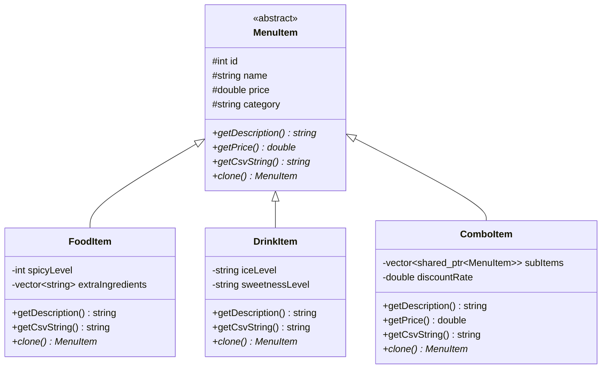

# C++ 智慧點餐收銀系統 (Food Ordering System)

本專案是一個基於 C++ 語言開發的終端機點餐與收銀管理系統，設計作為 C++ 期末專題。專案完整展示了物件導向程式設計（OOP）的核心概念如繼承與多型，並靈活運用 C++ 標準函數庫 (STL) 及檔案持久化讀寫技術。

---

## 系統核心特色

1. **物件導向繼承與多型 (Polymorphism)**
   - 使用抽象基底類別 `MenuItem` 定義基礎介面。
   - 衍生出 `FoodItem` (食物類，具備辣度與額外配料加購)、`DrinkItem` (飲料類，具備糖度冰量客製化) 及 `ComboItem` (套餐類，內含多個子品項並套用折扣價格)。
   - 透過 `std::shared_ptr<MenuItem>` 進行動態多型管理，實現統一的菜單渲染及價格計算。

2. **記憶體管理與 STL 應用**
   - 採用智慧指標 (`std::shared_ptr`) 管理物件生命週期，防止記憶體洩漏。
   - 使用 `std::vector` 儲存菜單資料與購物車品項。
   - 使用 `<algorithm>` 中的 `std::find_if`、`std::remove_if` 等演算法進行資料查找與刪除。
   - 使用 `std::stringstream` 配合 `<iomanip>` 控制雙精度浮點數格式化輸出。

3. **雙模式終端機互動介面 (Terminal UI)**
   - 顧客模式：可瀏覽菜單、新增/移除購物車、客製化細項（例如牛肉起司堡加蛋、大辣，或紅茶去冰無糖），並進行結帳。
   - 管理員後台：可即時查看菜單、動態新增/刪除品項（自動防呆計算下一組可用 ID）、讀取並呈現歷史交易明細。
   - **完全防呆設計 (Input Validation)**：對所有整數與浮點數輸入進行流重設與範圍驗證，徹底杜絕因非法字元輸入導致的終端機死循環。

4. **資料持久化 (File I/O)**
   - 菜單檔案 (`data/menu.csv`)：支援 CSV 格式解析載入，並可在後台編輯後即時覆寫存檔。
   - 訂單歷史 (`data/orders.txt`)：每次結帳時自動生成精美的 ASCII Art 收據，並以附加 (Append) 模式寫入檔案保存。

---

## 專案目錄結構

```text
w1/
├── CMakeLists.txt         # CMake 跨平台編譯設定檔
├── build.bat              # Windows g++ 一鍵編譯與執行腳本
├── data/
│   ├── menu.csv           # 菜單資料庫
│   └── orders.txt         # 歷史交易紀錄 (自動生成)
└── src/
    ├── main.cpp           # 程式入口點
    ├── MenuItem.hpp       # 商品類別架構定義 (繼承結構)
    ├── Menu.hpp           # 菜單管理類別宣告
    ├── Menu.cpp           # 菜單檔案載入與解析實作
    ├── Order.hpp          # 購物車與訂單計算宣告
    ├── Order.cpp          # 購物車邏輯與收據生成實作
    ├── UI.hpp             # 終端機 UI 邏輯宣告
    └── UI.cpp             # 互動選單與輸入驗證實作
```

---

## 物件導向類別設計

### 類別關係圖


- **原型模式（Prototype Pattern）應用**：定義 `clone()` 純虛擬函式。當顧客將商品加入購物車時，系統會複製該菜單項目，以確保顧客客製化（如：加起司、去冰）時，不會影響全域的主菜單範本。

---

## 檔案格式規範

### 菜單檔 (`data/menu.csv`)
使用逗號分隔，首欄代表物件類型，系統會依此使用不同衍生類別反序列化：
*   **Food**：`Food,ID,名稱,單價,預設辣度,加點配料(用|分隔)`
*   **Drink**：`Drink,ID,名稱,單價,冰量,甜度`
*   **Combo**：`Combo,ID,名稱,折扣折數,子商品ID(用|分隔)`

*範例：*
```csv
Food,101,經典牛肉起司堡,120.00,1,
Drink,201,錫蘭紅茶,30.00,正常冰,正常甜
Combo,301,經典單人超值餐,0.85,101|201
```

---

## 編譯與執行

### 環境需求
- 支援 C++17 或以上標準的編譯器（如 GCC 7+, MSVC 2017+, Clang 5+）。
- CMake 3.10+ (選用)。

### 方式一：Windows 環境下一鍵編譯 (推薦)
在專案根目錄下，雙擊或於終端機執行 `build.bat`：
```cmd
.\build.bat
```
腳本將自動偵測 `g++`，編譯專案並生成 `FoodOrderingSystem.exe`，最後自動啟動系統。

### 方式二：使用 CMake 編譯 (跨平台)
1. 建立建置資料夾並設定：
   ```bash
   mkdir build
   cd build
   cmake ..
   ```
2. 進行編譯：
   ```bash
   cmake --build .
   ```
3. 執行程式：
   - Windows: `.\Debug\FoodOrderingSystem.exe` 或 `.\FoodOrderingSystem.exe`
   - Linux / macOS: `./FoodOrderingSystem`

---

## 操作指南

1. **主選單**：選擇進入 `[1] 顧客模式` 或 `[2] 管理員模式`。
2. **顧客模式**：
   - 瀏覽動態載入的分類菜單與購物車現況。
   - 輸入商品 ID 即可加入購物車，並會彈出針對該類型的**客製化選單**。
   - 輸入 `3` 進入結帳頁面，系統會生成臨時收據，確認後存檔並清空購物車。
3. **管理員後台**：
   - 輸入 `2` 可新增商品，選擇 Food/Drink/Combo，若選擇 Combo 可自由組合現有 ID。
   - 輸入 `3` 可以指定 ID 刪除菜單品項，存檔將即時同步至 `menu.csv`。
   - 輸入 `4` 可以直接查看 `orders.txt` 中的所有歷史交易收據明細。
